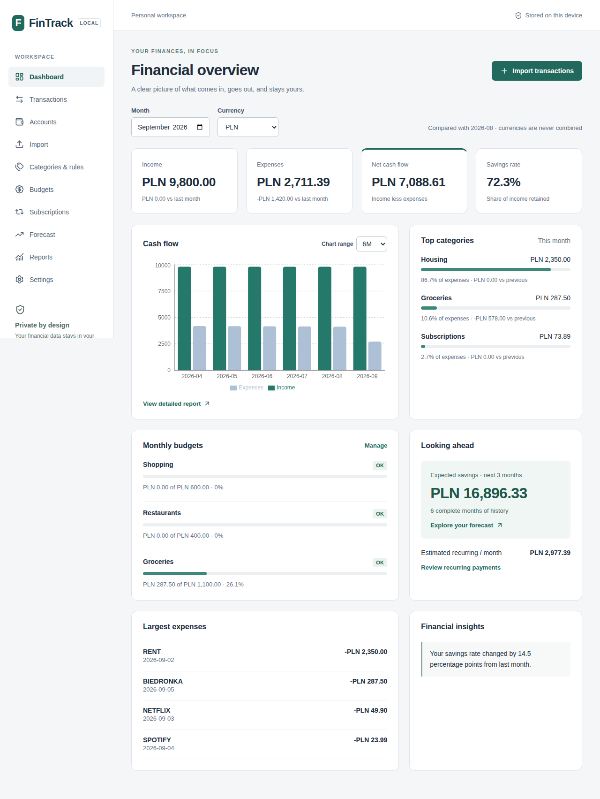
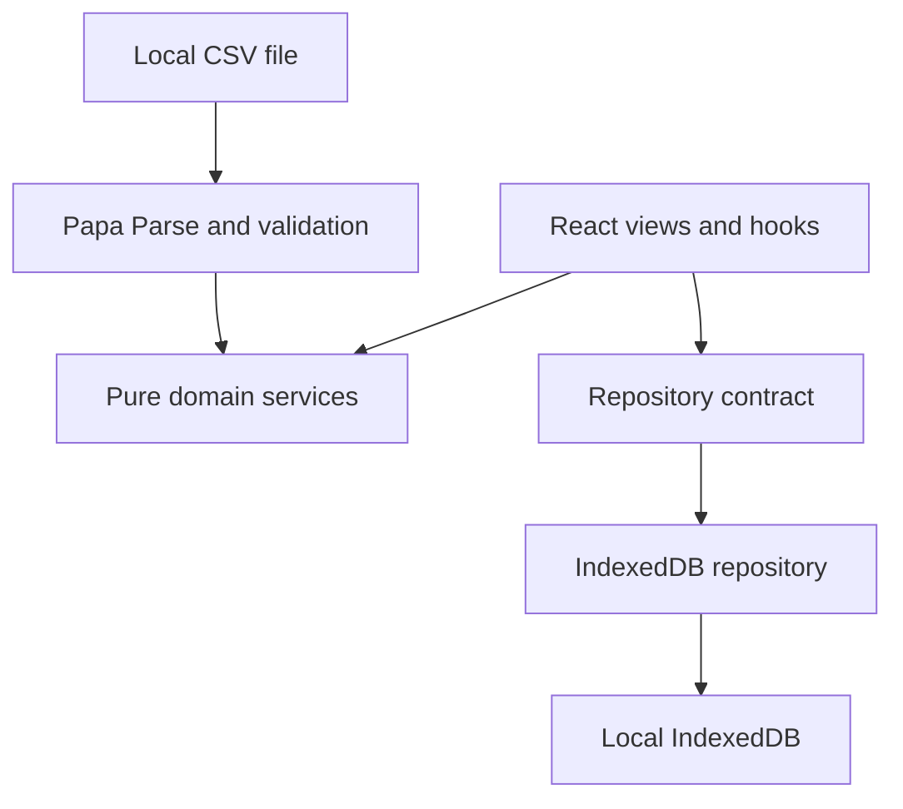

# FinTrack

A private personal finance dashboard that runs entirely in your browser. Import bank CSVs, understand cash flow, manage budgets and forecast savings without creating an account or sending financial data to a server.

**Live demo:** [sundreamsoftware.github.io/FinTrack](https://sundreamsoftware.github.io/FinTrack/)

Open **Settings → Load demo data** in an empty workspace to explore fictional finances.

## Features

- Multiple accounts with initial balances, editing, archiving and confirmed deletion.
- Local generic CSV import: UTF-8/BOM, comma/semicolon/tab, column mapping, validation, preview, duplicate review and import history.
- Searchable, filterable and paginated transactions; editable categories, types and notes; internal transfers excluded from cash flow.
- Custom categories, prioritized user rules, merchant aliases and optional reclassification after manual corrections.
- Monthly dashboard: income, expenses, savings rate, budgets, category comparisons, large expenses, recurring costs and insights.
- Reports for 1/3/6/12 months or all available history, with exact accessible tables.
- Monthly or one-month category budgets with explicit OK / WARNING / EXCEEDED states.
- Deterministic recurring-payment detection, confidence scores, confirmation, rejection and reactivation.
- Savings scenarios for 1/3/6/12 months, including lower and upper estimates and an explanation of every input.
- Versioned, validated JSON backups; atomic restore; explicit reset confirmation; fictional demo data.
- Responsive keyboard-accessible interface, semantic forms, visible focus and global error recovery.

## Screenshots



[Mobile dashboard screenshot](docs/screenshots/dashboard-mobile.png). Screenshots are generated by the Playwright demo scenario and contain fictional data only.

## Architecture



Domain services are independent of React and Dexie. IndexedDB is the durable source of truth; Dexie live queries refresh view snapshots after writes, including writes in other tabs. React state contains only transient form and view state. Multi-table operations are atomic.

See [architecture](docs/architecture.md), [decisions](docs/decisions.md), and [algorithm details](docs/algorithms.md).

## Data privacy

**Your financial data stays in your browser. FinTrack does not upload transaction history to a server.**

There is no API server, external database, analytics, tracking, bank integration or AI service. Scripts, styles and icons are bundled locally. A Content Security Policy restricts connections to the application's own origin. JSON backups are readable and should be stored privately. IndexedDB is browser-profile-specific and not encrypted by FinTrack. Clearing browser storage removes the data; exporting backups is essential.

## Tech stack

React 19, strict TypeScript, Vite, React Router with HashRouter, Dexie / IndexedDB, Papa Parse, Zod, Recharts, Lucide, Vitest, React Testing Library, Playwright, ESLint, Prettier and GitHub Actions. Native CSS and semantic HTML keep the UI layer small; no additional state-management or component framework is needed.

## Project structure

```text
src/
  app/                Routing, shell, error boundary
  domain/             Models, validation, money, dates, rules and analytics
  features/           Accounts, import, transactions, dashboard and other views
  infrastructure/     IndexedDB repositories, CSV, backup and fictional demo
  shared/             Components, reactive hooks and chart views
  test/               Shared test setup and fictional fixtures
e2e/                  Desktop and mobile acceptance scenarios
examples/             Fictional CSVs
public/examples/      Downloadable copies of the example CSVs
docs/                 Architecture, decisions and algorithms
.github/workflows/    Quality gates and Pages deployment
```

## Quick start

Requires Node.js 22.12+ and npm.

```bash
npm ci
npm run dev
```

Open the URL printed by Vite, including `/FinTrack/`. Create an account, import a CSV, map columns, review candidates and confirm. Imported data survives page reloads and browser restarts in the same profile.

## Development

```bash
npm run lint
npm run typecheck
npm run format
npm run format:check
npm run build
npm run preview
```

`strict`, `noImplicitAny`, `strictNullChecks` and `noUncheckedIndexedAccess` are enabled. Monetary values are signed integer minor units. Parsing uses decimal strings and BigInt; checked integer sums reject overflow. Currency precision comes from Intl (including zero- and three-decimal currencies). Different currencies are never summed together. Amount sorting groups currencies separately.

## Testing

```bash
npm run test
npm run test:watch
npx playwright install --with-deps chromium
npm run e2e
```

Vitest covers money and date boundaries, CSV formats and validation, duplicate multiplicities, categorization priority, transfers/refunds, budgets, subscriptions, forecasting, backup validation and IndexedDB integration. React Testing Library checks accessible empty states and error announcements.

Playwright runs desktop Chromium and mobile emulation against a production build under `/FinTrack/`. It covers account creation, import, refresh persistence, reimport, category correction and rules, exact-threshold budgets, subscription states, export/reset/restore and demo/forecast/report navigation. The network assertion rejects any third-party requests.

To run the same suite against an existing deployment:

```bash
PLAYWRIGHT_BASE_URL=https://sundreamsoftware.github.io/FinTrack/ npm run e2e
```

PowerShell:

```powershell
$env:PLAYWRIGHT_BASE_URL = 'https://sundreamsoftware.github.io/FinTrack/'
npm run e2e
```

## GitHub Pages deployment

The quality workflow runs install, lint, type checking, formatting validation, unit/integration tests, build and E2E. After a successful `main` push, official GitHub Pages actions publish `dist` using a Pages artifact and OIDC. Pull requests run quality gates without deploying. Build permissions are read-only; only the deployment job receives `pages: write` and `id-token: write`.

Vite's `base` is `/FinTrack/`. HashRouter keeps routes such as `/FinTrack/#/transactions` refresh-safe without a server fallback. There is no service worker to retain outdated releases.

If the repository's Pages feature has never been enabled and organization policy blocks automatic enablement, select **Settings → Pages → Source → GitHub Actions** once, then rerun the workflow. No `dist` copying or separate backend is needed.

## CSV import

1. Create an account with the CSV currency.
2. Select a UTF-8 CSV up to 10 MB / 100,000 rows.
3. Map date, signed amount and description or title; optional fields include booking date, currency, counterparty, counterparty account and balance.
4. Review valid, new, exact duplicate, potential duplicate and invalid counts.
5. Explicitly include legitimate potential duplicates and confirm.

Expenses must have negative amounts; incoming payments positive. Dates support `YYYY-MM-DD` and day-first `DD.MM.YYYY`, `DD/MM/YYYY`, `DD-MM-YYYY`. Decimal points/commas and unambiguous grouped amounts are supported. An absent currency uses the account currency; mismatches are invalid. US month-first dates and legacy encodings need conversion before import.

Exact duplicate detection matches account/date/amount/currency/normalized description/counterparty and preserves occurrence counts. Two identical payments in the same file require explicit review of the second occurrence. Cross-tab changes invalidate a stale preview. Original CSV files are not retained.

Examples: [Polish generic](examples/generic-pl.csv), [subscriptions](examples/subscriptions.csv), [six months](examples/monthly-finances.csv).

Only the generic profile is implemented: unverified bank-specific formats are not advertised as supported. Add a strategy implementing `CsvImportStrategy` when reliable fixtures are available.

## Backup

**Settings → Export backup** downloads JSON with format version, export date and all entities. **Import backup** validates every collection, duplicate ID, reference, currency, date and amount before asking to replace current data. Restore is all-or-nothing. Unsupported versions are rejected. Reset requires typing `DELETE` and confirming a modal. Store a backup before changing browsers or clearing site data.

## Roadmap and limitations

- Verified bank-specific CSV strategies and optional encrypted backup using Web Crypto.
- FX conversion, automatic bank connections and device synchronization are intentionally absent.
- No PWA offline shell: initial app loading needs access to GitHub Pages; calculations and storage are local.
- Recurring detection groups one dominant payment pattern per account/currency/merchant. Multiple subscriptions to the same merchant may require manual review.
- Forecasts use at most six completed calendar months and do not model investments, future salary changes or uncertainty from incomplete imported history.
- Views memoize derived data and paginate tables; very large datasets still produce a local read snapshot. CSV parsing runs on the main thread within explicit limits.

## License

[MIT](LICENSE). Example and demo records are entirely fictional.
