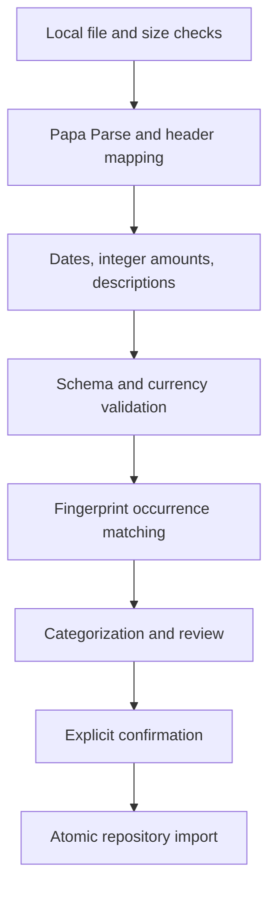

# Architecture

## Runtime and boundaries

FinTrack is a static React SPA served below `/FinTrack/` on GitHub Pages. Browser APIs handle files, UUIDs, formatting and downloads. There are no server routes, credentials or external data dependencies. Hash routing works without a Pages fallback.

`features` owns user workflows. `domain` owns validated models, integer money, calendar helpers, transaction selectors, categorization, duplication, cash flow, budgets, subscriptions and forecasting. `infrastructure` owns CSV parsing, JSON serialization and Dexie persistence. Shared components format and render results rather than calculating financial aggregates in JSX.

`FinanceRepository` documents the persistence boundary. `IndexedDbFinanceRepository` implements it and provides atomic application operations for imports, corrections and restore. Components call repository operations; domain calculations accept plain typed data. Dexie's live query subscribes to reads, so a committed write refreshes the relevant screen, including changes from another tab. Snapshots are read models, not a parallel durable React store.

## Database

Schema version 1 contains accounts, transactions, categories, merchants, merchantAliases, rules, imports, budgets, subscriptions and settings. Transaction indexes include account, date, account/date, currency/date, category, merchant, fingerprint and import. Fingerprint is deliberately **not unique** because distinct legitimate payments can share every exported field.

Imports recheck the account's transaction IDs inside the same read/write transaction that inserts transactions, new merchants and an import record. A concurrent import invalidates a stale preview. A correction and its optional rule are atomic. Account deletion removes associated history, imports and subscriptions. Backup restore validates before entering one transaction, then replaces every collection; any exception aborts the write.

New schema versions must retain version 1 and add `version(2).stores(...).upgrade(...)` with a tested migration. Do not delete/recreate the database to migrate. Test populated v1 databases, assert preserved IDs and values, and test abort behavior before shipping any migration. Backup format versions are independent; unsupported versions currently fail before writing.

## CSV pipeline

The generic importer implements a strategy interface. Header aliases assist mapping; they do not pretend to recognize a bank's proprietary export. Preserve raw descriptions and optional source columns, but never retain the uploaded original file. File-size and row-count limits constrain memory use. Preview and transaction tables render 50 rows per page.

## Categorization

Explicit rules, ordered by numeric priority then stable ID, precede merchant category mappings, the latest manual category for the same merchant, keyword rules and an uncategorized fallback. Reclassification requires an explicit user action and preserves rule precedence. Merchant normalization uses known merchant terms and user aliases, with no NLP service or arbitrary regular-expression execution.

## Analytics

All totals filter currency first. Transfers contribute neither income nor expenses. Positive refunds reduce expenses. Zero income produces an unavailable savings rate. Budget thresholds are named constants; recurring monthly budgets start at their configured month, and overlapping category/currency budgets are rejected.

Monthly series and category totals are memoized by source snapshot and selected filters. Forecast uses complete calendar months, explicitly excluding the incomplete current month. Subscription and forecast details are documented in [algorithms.md](algorithms.md).

## Failures, accessibility and privacy

Forms and file inputs validate at the boundary. Storage and validation failures have shared user feedback. A React error boundary offers refresh and dashboard recovery without clearing the database. Browser capability checks happen before startup. Diagnostics do not log transaction content.

Semantic labels, native select/input/button elements, visible focus, skip navigation, live status/error messages and native modal dialogs support keyboard access. Charts have equivalent report tables. Status labels accompany colors. Tables scroll within a labeled region on narrow screens; navigation remains horizontally reachable.

No external fonts, analytics, image services or API calls are used. A CSP restricts origins, scripts, form submissions and embedded content. JSON downloads avoid spreadsheet formula execution; no CSV export is implemented.

## Deployment

GitHub Actions validates the source, installs Chromium, runs desktop/mobile E2E against `dist`, uploads the Pages artifact and deploys after a passing `main` build. Only the deploy job can write Pages and obtain an OIDC token. A manual workflow trigger supports redeployment after repository-level Pages setup. The lockfile and Node 22 are used in CI.
